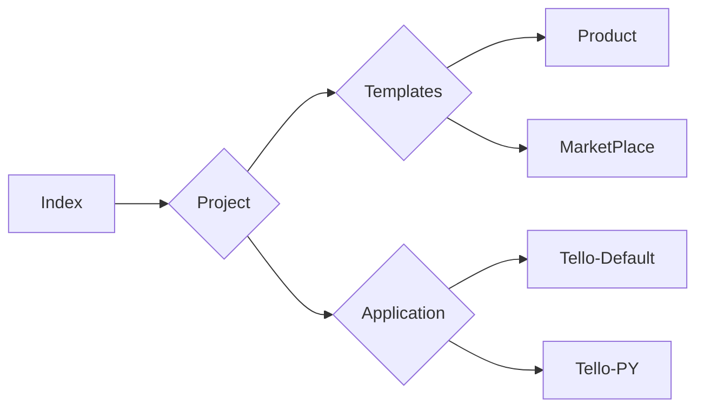

# Sobre o Projeto:

Instruir pesssoas a utilização de programação e dispositivos IOT.

# Sobre o Projeto:
Estudos utilizando o drone DJI Tello + Python

- SDK DJI-Tello
- Python

### FLUXOGRAMA/DIAGRAMA

### FONTE:
<ul>
  
  <li>
    
<b><code>DOCUMENTS & MANUALS.</code></b>

    
<i>URL: https://www.ryzerobotics.com/tello/downloads</i>

  </li> 
  <li>
    
<b><code>Como PROGRAMAR o DJI TELLO - Novo DRONE da DJI - Brasil. </code></b>

    
<i>URL: https://www.youtube.com/watch?v=eDJmekMGb88 </i>

  </li> 
  <li>
    
<b><code>Tello com GPS! Função vGPS do aplicativo TelloFPV. </code></b>

    
<i>URL: https://www.youtube.com/watch?v=JsvNeJLfX5E&t=48s </i>

  </li> 
    <li>
    
<b><code>DJI Tello, Controlando o drone usando Python. </code></b>

    
<i>URL: https://www.youtube.com/watch?v=g0PWBT02InI </i>

  </li> 
  <li>
    
<b><code>3D Printed DJI Tello Propellers. </code></b>

    
<i>URL: https://www.youtube.com/watch?v=z6wkOHIcf2Q</i>

  </li> 

</ul>
